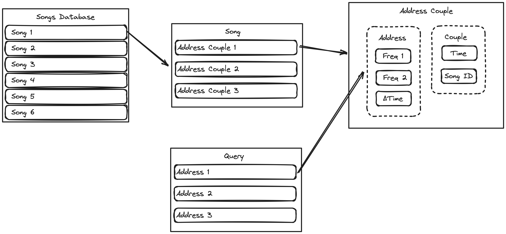
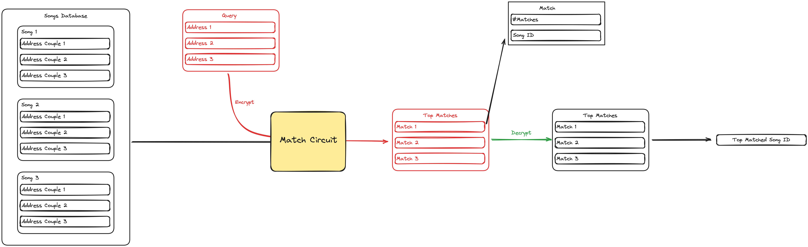

# Fully Homomorphic Encrypted Shazam

A secure Shazam implementation, using [Concrete](https://github.com/zama-ai/concrete) for fully homomorphic encryption, implemented as the solution to the [Privacy Preserving Shazam Bounty](https://github.com/zama-ai/bounty-program/issues/79) in the [Zama Bounty Program](https://github.com/zama-ai/bounty-program).

We implement the algorithm as described in [1], and 2, augmented with homomorphic encryption for achieving security. Below are [Motivation](#motivation), [System Architecture](#system-architecture), [Usage](#usage), and [References](#references).

## Motivation

Shazam is a super popular company. Everywhere we go, we hear different songs. Humans are curious, and being able to find the song’s name by just recording it made Shazam very popular.

The problem is that while recording the song, you also record the background noise. That background noise might contain private information such as conversations. Additionally, even the song itself might reveal information you deem private.

Thanks to homomorphic encryption, Shazam doesn’t have to use your private data. We propose an encrypted song recognition system; in other words, Encrypted Shazam.

## System Architecture

### High-Level Overview

Our algorithm mimics the techniques described in the original paper while adapting some parts for securing user data via homomorphic encryption. The central entities of the system are the Song Database and the Query, below is a visual description of the contents of those entities.

In the figure, you can see 4 data types, enclosed in sharp-edged rectangles: `Song Database`, `Song`, `Query`, and `Address Couple` where `Address Couple` is indeed a combination of two smaller data types `Address` and `Couple`. This figure represents the data in its post-processed form. Initially, all we have is a set of `.mp3` files. For each song, we construct a **[spectrogram](https://en.wikipedia.org/wiki/Spectrogram)** that represents the frequencies of the song and generate a **constellation map**. A constellation map is a simplified spectrogram, acquired by separating the spectrogram into separate frequency bands and picking the *strongest* signal.

Using the constellation map, we generate address couples. An address is a $(frequency, frequency, \Delta time)$ triple, a couple is $(time, id)$, and an address couple is $(frequency, frequency, \Delta time, time, id)$.

Our song database consists of thousands of address couples. When we receive a query, we apply the same pre-processing to the query for generating addresses and run our `Match Circuit` for generating the top-matched songs. Below, you can see the pipeline. The circuit generates **top matches** from the database in an encrypted setting. 

### Pre-Processing

### Unencrypted Song Matching

### Encrypted Song Matching

### Cost Analysis

## Usage

### Download Data

~~~
mkdir data
cd data

curl -O https://os.unil.cloud.switch.ch/fma/fma_metadata.zip
curl -O https://os.unil.cloud.switch.ch/fma/fma_small.zip

unzip fma_metadata.zip
unzip fma_small.zip
~~~

## References

- [1] [http://web.archive.org/web/20220823105405/http://coding-geek.com/how-shazam-works/](http://web.archive.org/web/20220823105405/http://coding-geek.com/how-shazam-works/)
- [2] [https://www.ee.columbia.edu/~dpwe/papers/Wang03-shazam.pdf](https://www.ee.columbia.edu/~dpwe/papers/Wang03-shazam.pdf) 
